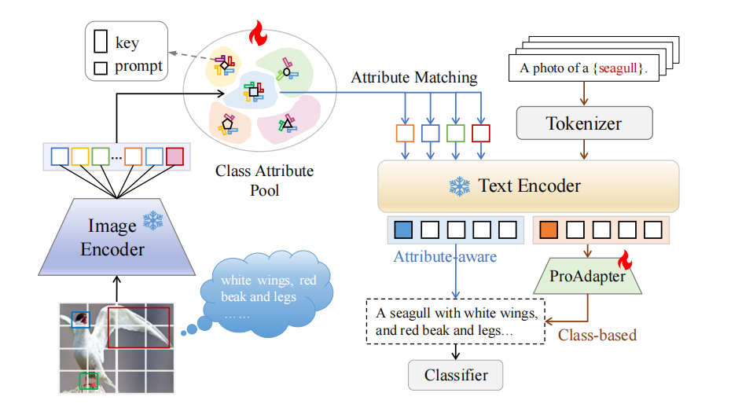

# AttriPrompt: Class Attribute-aware Prompt Tuning for Vision-Language Model
Official implementation of ['AttriPrompt: Class Attribute-aware Prompt Tuning for Vision-Language Model'](https://ieeexplore.ieee.org/document/11367371).



## How to Install

This code is built on top of [CoOP](https://github.com/KaiyangZhou/CoOp). So you need to install the environment following CoOP first. After that, run pip install -r requirements.txt to install a few more packages.

Follow [DATASET.md](https://github.com/KaiyangZhou/CoOp/blob/main/DATASETS.md) to install 11 datasets referring to [CoOp](https://github.com/KaiyangZhou/CoOp).


## How to Run

The running scripts are provided in `scripts/attriprompt/`, which allow you to reproduce the results on the TIP'26 paper.


## Training
To perform mixed-modal training, please refer to [train.py](train.py).

For all dataset training, you can use

```
bash ./scripts/attriprompt/main_attri.sh
```

##Other VLMs 
We also provide the versions to migrate AttriPrompt to other VLMs, including [BLIP](https://github.com/salesforce/BLIP). If you want to train, you need to download the pre trained model parameters (ViT-B/16) in advance. Then, using

```
bash ./scripts/attriprompt/main_attri_blip.sh
```

##Other Prompt-tuning Models 
We have also integrated many other prompt tuning methods, please refer to their website for detailed training details.


## Citation
If you use this code in your research, please kindly cite the following papers:

```
@article{su2026attriprompt,
  title={AttriPrompt: Class Attribute-aware Prompt Tuning for Vision-Language Model},
  author={Su, Yuling and Liu, Xueliang and Huang, Zhen and Zhao, Yunwei and Hong, Richang and Wang, Meng},
  journal={IEEE Transactions on Image Processing},
  year={2026},
  doi={10.1109/TIP.2026.3657216},
  publisher={IEEE}
}
```

